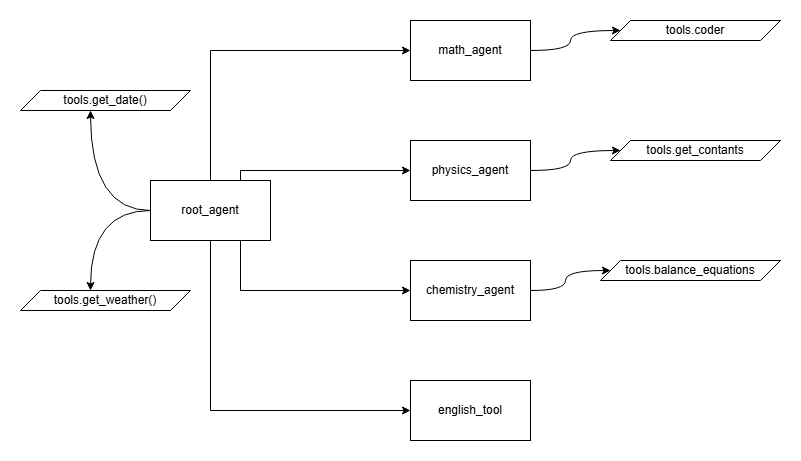

# Tutor - AI-Powered Educational Assistant

A multi-agent AI tutor system that specializes in academic subjects including Mathematics, Physics, Chemistry, and English. Built using Google's Agent Development Kit (ADK) with Gemini models.

## Basic Architecture



## Overview

This project implements an intelligent tutoring system that:
- Coordinates multiple specialized subject agents
- Executes Python code to solve math problems
- Balances chemical equations
- Provides physics constants
- Assists with English language tasks and NCERT English materials
- Retrieves weather information for contextual learning

## Architecture

```
Tutor/
├── agent.py            # Root agent that coordinates sub-agents
├── tools.py            # Shared tools (weather, date)
└── sub_agents/         # Subject-specific agents
    ├── math_agent/     # Mathematics capabilities
        ├──__init__.py
        ├── math_agent.py # Main math agent logic
        └── math_tools.py # Tools for math operations
    ├── physics_agent/  # Physics capabilities
        ├── __init__.py
        ├── physics_agent.py # Main physics agent logic
        └── tools.py # Tools for physics constants
    ├── chemistry_agent/# Chemistry capabilities
        ├── __init__.py
        ├── chemistry_agent.py # Main chemistry agent logic
        └── tools.py # Tools for chemical equations
    └── english_agent/  # English language assistance
        ├── __init__.py
        └── english_agent.py # Main English agent logic
        
├── requirements.txt    # Python dependencies
├── Dockerfile          # Docker configuration
├── .env                # Environment variables
└── README.md           # Project documentation
```

## Features

### Root Agent
- Coordinates multiple specialized sub-agents
- Provides date and weather information
- Routes questions to appropriate sub-agents

### Math Agent
- Executes Python code to solve mathematical problems
- Implements security guardrails for safe code execution
- Captures and returns execution outputs
- Solves Integrals, Derivatives, Word Problems, and more

### Chemistry Agent
- Balances chemical equations
- Parses chemical compounds
- You can ask it about any element or compound

### Physics Agent
- Provides physics constants
- Additionally ask it core questions related to physics
- Can solve physics-related problems, with help from the Math Agent if needed

### English Agent
- Assists with language tasks
- Specializes in NCERT English reading and poetry
- Can answer questions about English literature and grammar

## Installation

### Using Docker

```bash
# Clone the repository
git clone <repository-url>
cd Tutor

# Build the Docker image
docker build -t tutor-ai .

# Run the container
docker run -p 8000:8000 tutor-ai
```

### Manual Installation

```bash
# Clone the repository
git clone <repository-url>
cd Tutor

# Create and activate a virtual environment
python -m venv venv
source venv/bin/activate  # On Windows: venv\Scripts\activate

# Install dependencies
pip install -r requirements.txt

# Run the application
cd Tutor
adk web --host 0.0.0.0 --port 8000
```

## Environment Setup

Create a `.env` file in the Tutor directory with the following variables:

```
GOOGLE_GENAI_USE_VERTEXAI=FALSE
GOOGLE_API_KEY=your_google_api_key
MODEL_GEMINI_2_0_FLASH=gemini-2.0-flash
WEATHER_API_KEY=your_weather_api_key
```

## Usage Examples

### Solving Math Problems
The system can interpret and solve mathematical word problems by converting them to Python code.

### Balancing Chemical Equations
Input chemical equations to be balanced (e.g., "H2 O2" → "H2O").

### Getting Weather Information
Request current weather for specific locations to integrate real-world data.

## Technical Details

- Built with Google ADK and Gemini models
- Uses LiteLLM for multi-model support
- Implements security guardrails for code execution
- Containerized with Docker for easy deployment

## Dependencies

Main dependencies include:
- google-adk
- google-genai
- sympy (for chemical equation balancing)
- requests (for API calls)
- fastapi (for web interface)

See `requirements.txt` for a complete list.